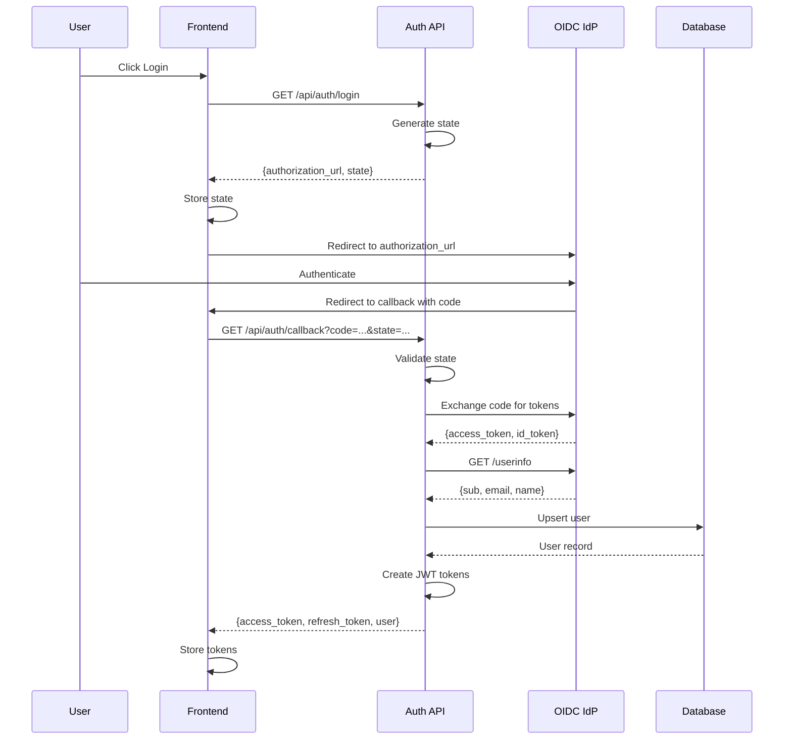
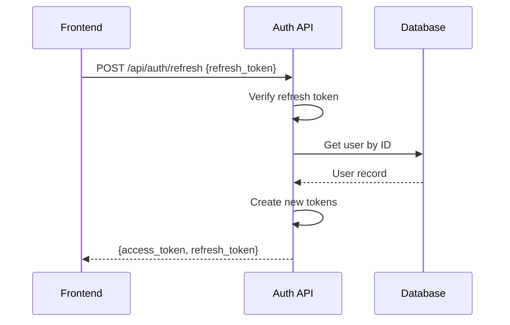
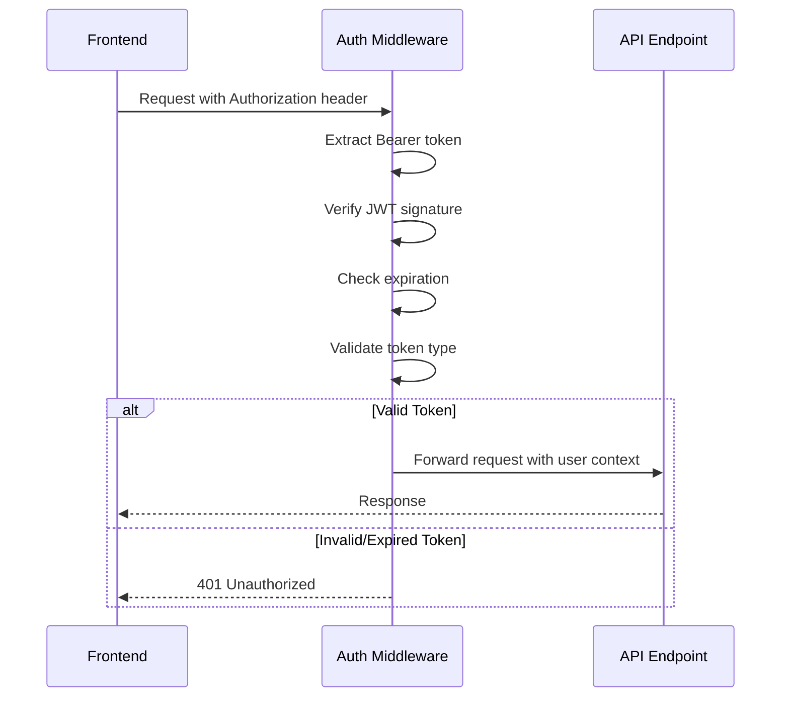

# KIT Documentation — REQ-002: OIDC Authentication Integration

## Summary

This KIT implements OIDC (OpenID Connect) authentication integration for the VoiceSurveyAgent application. It provides a complete authentication flow including:

- OIDC authorization code flow with configurable Identity Provider (IdP) endpoints
- JWT-based session management with access and refresh tokens
- User provisioning on first login with OIDC subject mapping
- Authentication middleware for protecting API endpoints
- Role-based user profiles

## Architecture

### Component Overview

```
┌─────────────────────────────────────────────────────────────────┐
│                        FastAPI Application                       │
├─────────────────────────────────────────────────────────────────┤
│  ┌─────────────┐  ┌─────────────┐  ┌─────────────────────────┐ │
│  │   Router    │  │  Middleware │  │      Auth Service       │ │
│  │ /api/auth/* │──│  (JWT Auth) │──│  (Orchestrates flows)   │ │
│  └─────────────┘  └─────────────┘  └───────────┬─────────────┘ │
│                                                 │               │
│  ┌─────────────────────────────────────────────┼───────────────┤
│  │                                             │               │
│  │  ┌─────────────┐  ┌─────────────┐  ┌───────┴─────┐        │
│  │  │ OIDC Client │  │ JWT Service │  │  User Repo  │        │
│  │  │ (IdP calls) │  │ (Token ops) │  │ (Database)  │        │
│  │  └──────┬──────┘  └─────────────┘  └──────┬──────┘        │
│  │         │                                  │               │
│  └─────────┼──────────────────────────────────┼───────────────┘
│            │                                  │               │
└────────────┼──────────────────────────────────┼───────────────┘
             │                                  │
             ▼                                  ▼
    ┌─────────────────┐                ┌─────────────────┐
    │  OIDC Provider  │                │   PostgreSQL    │
    │  (External IdP) │                │   (Users table) │
    └─────────────────┘                └─────────────────┘
```

### Module Structure

```
app/
├── __init__.py
├── config.py           # Settings and configuration
├── main.py             # FastAPI application entry point
├── auth/
│   ├── __init__.py     # Public exports
│   ├── jwt.py          # JWT token creation and verification
│   ├── middleware.py   # Authentication middleware
│   ├── models.py       # SQLAlchemy User model
│   ├── oidc.py         # OIDC client for IdP integration
│   ├── repository.py   # User database operations
│   ├── router.py       # API endpoints
│   ├── schemas.py      # Pydantic schemas
│   └── service.py      # Authentication service
└── shared/
    ├── __init__.py
    ├── database.py     # Database session management
    ├── exceptions.py   # Custom exceptions
    └── logging.py      # Structured JSON logging
```

## Authentication Flow

### Login Flow



### Token Refresh Flow



### Protected Request Flow



## API Reference

### GET /api/auth/login

Initiates the OIDC login flow.

**Response:**
```json
{
  "authorization_url": "https://idp.example.com/authorize?...",
  "state": "random-state-string"
}
```

### GET /api/auth/callback

Handles the OIDC callback after user authentication.

**Query Parameters:**
- `code`: Authorization code from IdP
- `state`: State parameter for CSRF validation

**Response:**
```json
{
  "access_token": "eyJ...",
  "refresh_token": "eyJ...",
  "token_type": "Bearer",
  "expires_in": 3600,
  "user": {
    "id": "uuid",
    "oidc_sub": "oidc|123",
    "email": "user@example.com",
    "name": "User Name",
    "role": "viewer",
    "created_at": "2024-01-01T00:00:00Z",
    "updated_at": "2024-01-01T00:00:00Z"
  }
}
```

### POST /api/auth/refresh

Refreshes access and refresh tokens.

**Request Body:**
```json
{
  "refresh_token": "eyJ..."
}
```

**Response:**
```json
{
  "access_token": "eyJ...",
  "refresh_token": "eyJ...",
  "token_type": "Bearer",
  "expires_in": 3600
}
```

### GET /api/auth/me

Returns the current authenticated user's profile.

**Headers:**
- `Authorization: Bearer <access_token>`

**Response:**
```json
{
  "id": "uuid",
  "oidc_sub": "oidc|123",
  "email": "user@example.com",
  "name": "User Name",
  "role": "campaign_manager",
  "created_at": "2024-01-01T00:00:00Z",
  "updated_at": "2024-01-01T00:00:00Z"
}
```

## Configuration

### Environment Variables

| Variable | Description | Default |
|----------|-------------|---------|
| `OIDC_ISSUER_URL` | OIDC Identity Provider URL | Required |
| `OIDC_CLIENT_ID` | OIDC client identifier | Required |
| `OIDC_CLIENT_SECRET` | OIDC client secret | Required |
| `OIDC_REDIRECT_URI` | Callback URL after auth | Required |
| `OIDC_SCOPES` | Space-separated scopes | `openid profile email` |
| `JWT_SECRET_KEY` | Secret for signing JWTs | Required |
| `JWT_ALGORITHM` | JWT signing algorithm | `HS256` |
| `JWT_ACCESS_TOKEN_EXPIRE_MINUTES` | Access token TTL | `60` |
| `JWT_REFRESH_TOKEN_EXPIRE_DAYS` | Refresh token TTL | `7` |

## Security Considerations

1. **State Parameter**: CSRF protection via state parameter validation
2. **Token Types**: Separate access and refresh tokens with different lifetimes
3. **Token Validation**: Full JWT signature and expiration verification
4. **Secure Defaults**: Tokens expire, secrets required in production
5. **Structured Logging**: Security events logged with correlation IDs

## Dependencies

- `fastapi>=0.111.0` - Web framework
- `pydantic>=2.7.0` - Data validation
- `sqlalchemy[asyncio]>=2.0.30` - Database ORM
- `httpx>=0.27.0` - HTTP client for OIDC
- `pyjwt>=2.8.0` - JWT handling

## Acceptance Criteria Verification

| Criterion | Status | Implementation |
|-----------|--------|----------------|
| OIDC authorization code flow with configurable IdP | ✅ | `OIDCClient` class with configurable settings |
| JWT tokens validated on every API request | ✅ | `AuthMiddleware` validates all protected routes |
| User record created/updated on first login | ✅ | `UserRepository.upsert_from_oidc()` |
| Configurable token expiration with refresh | ✅ | Settings-driven expiration, refresh endpoint |
| Invalid/expired tokens return 401 | ✅ | Middleware returns proper error responses |
| Login endpoint returns user profile with role | ✅ | Callback response includes full user profile |