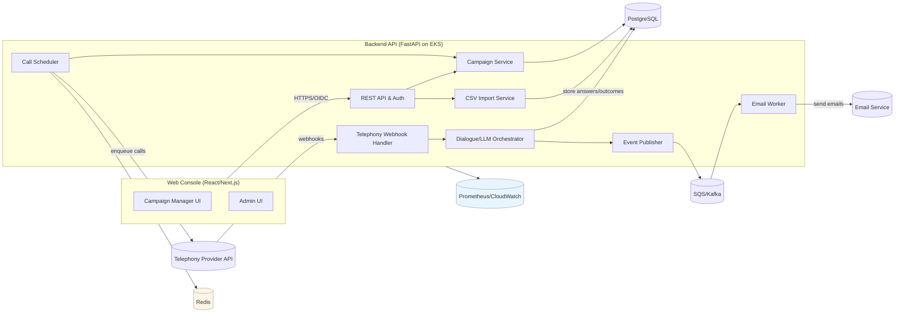

# SPEC — voicesurveyagent

## Summary
AI-driven outbound phone survey system that runs a single configurable 3-question survey campaign using one telephony/voice AI provider. It automates call attempts, consent handling, short natural-language conversations, structured answer capture, retries, and basic follow-up emails. A web console allows campaign setup from CSV and monitoring results with dashboards and CSV exports. Slice‑1 targets up to ~1,000 calls/day on AWS (EKS, Postgres, Redis, SQS), with GDPR-aligned consent, logging, and retention controls.

## Goals
- Allow a non-technical campaign manager to configure and launch a 3-question outbound survey campaign from a CSV contact list.
- Automate outbound calling, consent, survey questioning, retries (up to 5 attempts/contact), and basic follow-up emails.
- Provide standardized, compliant call flows with explicit identity, purpose, duration, and opt-out handling.
- Capture structured outcomes and survey answers for 100% of completed/attempted calls and expose them via dashboard and CSV export.
- Achieve <1.5s P95 conversational round-trip latency for speech–LLM–speech during calls (provider + app combined).
- Provide strong observability (logs, metrics, traces) and auditability (consent, outcomes, retention) suitable for GDPR-oriented deployments.

## Non-Goals
- Handling inbound calls, call transfers, or full contact-center workflows.
- Supporting more than 3 survey questions or complex branching/skip logic.
- Multi-tenant campaign management (slice‑1 is single-tenant).
- Deep CRM/ERP integrations or advanced BI analytics beyond basic metrics and CSV export.
- Running multi-channel surveys beyond simple transactional emails.
- Implementing multiple concurrent telephony providers (only one fully wired provider in slice‑1).

## Users & Context
- **Primary user:** Survey/campaign manager
  - Uses web console to define survey script and questions, upload contact CSV, configure retries/time windows, start/stop campaign, monitor outcomes, and export results.
- **Secondary stakeholders:**
  - Legal/compliance: require auditable consent, opt-out and exclusion lists, configurable retention, and topic restrictions.
  - IT/engineering: deploy and operate the platform on AWS; integrate with corporate IdP (OIDC), telephony/voice AI provider, LLM gateway, and email service.
  - Finance/ops: monitor call volumes, completion rates, and costs.
- **Context:**
  - Single-tenant deployment in AWS cloud (EKS), EU region (e.g., eu-central-1) with GDPR alignment.
  - One outbound telephony/voice AI provider (Twilio-like or voice AI platform) plus one LLM gateway.
  - Web-based back-office; voice-only interaction for respondents.
  - Languages: English and Italian for both campaign scripts and calls (slice‑1).

## Functional Requirements
- **Authentication & Authorization**
  - Integrate with OIDC IdP for user login (authorization code flow).
  - Implement RBAC with at least roles: `admin`, `campaign_manager`, `viewer`.
  - Restrict access to campaigns, contacts, transcripts, and exports based on roles.

- **Campaign Management**
  - Create, read, update, (soft-)delete a campaign with fields:
    - Name, description, status (draft, scheduled, running, paused, completed, cancelled).
    - Target language (EN/IT).
    - Intro script text (identity, purpose, duration, consent wording).
    - Up to 3 question prompts (text) and simple answer type (`free_text`, `numeric`, `scale`).
    - Retry policy: max attempts per contact (1–5), minimum interval, allowed call time windows (local time).
    - Email templates and toggles for `completed`, `refused`, `not_reached`.
  - Validate campaign configuration before activation (must have CSV contacts, 3 questions, valid retry/time window config).
  - Allow pausing/resuming a running campaign; pausing prevents new call attempts but does not terminate in-progress calls.

- **Contact & List Management**
  - Upload contact list as CSV with at minimum: `external_contact_id` (optional), `phone_number`, `email` (optional), `language` (optional override), `has_prior_consent` (bool), `do_not_call` (bool).
  - Validate CSV:
    - Schema, phone format (E.164 or configurable), email format, language support, boolean flags.
    - Accept ≥95% of valid rows; report invalid rows with line number and error.
  - Store contacts per campaign; each contact has state: `pending`, `in_progress`, `completed`, `refused`, `not_reached`, `excluded`.
  - Enforce global or campaign-level exclusion lists:
    - Import and manage `do_not_call` entries; mark related contacts as `excluded` and never dial.

- **Outbound Call Orchestration**
  - Scheduler service that:
    - Periodically scans for eligible `pending` or `not_reached` contacts with attempts < max_attempts and within allowed time windows.
    - Respects telephony provider concurrency/rate limits (configurable).
    - Enqueues call jobs to the telephony provider via its API.
  - For each call:
    - Generate a unique `call_id` and correlation ID.
    - Track call attempts per contact, with timestamps and provider metadata.
  - Implement maximum retry logic per contact; once exceeded, mark as `not_reached` and stop scheduling further calls.

- **Telephony & Voice AI Integration**
  - Implement a single provider adapter (slice‑1) behind an internal telephony interface to support future pluggability.
  - Support:
    - Outbound call initiation via REST API.
    - Webhook endpoint(s) to receive call events (ringing, answered, completed, failed, no_answer, busy).
    - Bi-directional audio over provider’s mechanism (e.g., WebSocket, streaming API, or provider-managed LLM voice agent).
  - Ensure call start audio:
    - Announces organization identity, purpose of call, estimated duration, and consent/opt-out instructions before asking first question.
  - Capture explicit consent:
    - Detect “yes/no” intent (via provider’s NLU or LLM).
    - If refusal: terminate survey, mark contact as `refused` and optionally trigger refusal email.
  - Run 3-question dialogue:
    - Ask questions sequentially after consent, allowing natural-language answers.
    - Confirm answer capture minimally (e.g., brief acknowledgements).
    - Handle simple repetitions upon user request (e.g., “Can you repeat?”).
  - End-of-call:
    - Confirm survey completion and say goodbye.
    - Provider or app-side logic must signal completion with final answer payloads and call outcome.

- **LLM & Dialogue Orchestration**
  - Use allowed LLM providers/models via LLM gateway.
  - System prompt and call-specific context:
    - Enforce structure: intro, consent request, up to 3 questions, closing.
    - Respect language settings (EN/IT).
    - Avoid prohibited content (e.g., political topics) – at least via runtime instructions and campaign metadata.
  - Limit conversational complexity to fixed flow; no dynamic branching beyond basic re-asking a question once.

- **Outcome & Event Logging**
  - For each call attempt, log:
    - Contact, campaign, attempt number, telephony provider call ID, start/end timestamps, outcome (completed/refused/no_answer/busy/failure), and error codes if any.
  - For each completed survey:
    - Store structured answers per question and end status `completed`.
  - Publish events to internal event bus (SQS/Kafka-like abstraction):
    - `survey.completed`
    - `survey.refused`
    - `survey.not_reached`
  - Events include: `campaign_id`, `contact_id`, `call_id`, timestamp, outcome, attempts_count, and answers (where applicable).

- **Email Notifications**
  - Email worker consuming events to:
    - Send configurable “thank you” email on `survey.completed`.
    - Optional refusal email on `survey.refused` (if configured).
    - Optional “sorry we couldn’t reach you” email on `survey.not_reached`.
  - Integrate with an SMTP or cloud email provider via configuration.
  - Log email delivery attempts and status per contact.

- **Dashboard & Reporting**
  - Web console features:
    - Campaign list view with key stats (total contacts, attempted, completed, refused, not_reached).
    - Campaign detail dashboard:
      - Time-series of call attempts and completions.
      - Summary completion/refusal/not_reached rates.
      - Average call duration, P95 conversational latency (if observable).
      - Table of contacts with outcome, attempts, last call timestamp.
    - Call detail view:
      - Outcome, attempt count, timestamps, basic transcript snippet or summary (if stored), and call recording link (if available).
  - CSV export per campaign:
    - Includes: `campaign_id`, `contact_id`, `external_contact_id`, `phone_number`, `outcome`, `attempt_count`, timestamps, and 3 answers (for completed).
    - Exclude transcripts and free-form PII beyond what is required.

- **Admin & Configuration**
  - Admin UI to:
    - Configure telephony provider credentials and basic parameters (concurrency limits, caller ID/number).
    - Configure LLM provider/model, base prompts, and safety/guardrails.
    - Configure storage retention for call recordings and transcripts (e.g., 180 days default).
    - Set email provider settings (SMTP/API keys) and default templates.
  - Environment mode:
    - Logical switch between “custom telephony API” vs “voice AI platform” (only one fully implemented in slice‑1; others stubbed).

## Non-Functional Requirements
- **Performance**
  - Conversational speech–LLM–speech round-trip latency P95 ≤1.5s during active calls (combined external + internal).
  - Scheduler and workers must handle up to ~1,000 call attempts/day with headroom (e.g., 5–10 concurrent calls) without degradation.
- **Availability**
  - Console and core APIs available ≥99% during business hours in pilot region.
  - Degraded mode: metrics and dashboard available even if telephony/LLM provider is temporarily degraded (no new calls).
- **Reliability**
  - At-least-once event delivery from call orchestration to email worker; idempotent email sending.
  - No more than 2% of calls per campaign with missing or inconsistent outcome/survey data.
- **Security**
  - OIDC-based SSO; all endpoints behind TLS (HTTPS).
  - Role-based access control with least privilege.
  - Secrets stored in AWS Secrets Manager; never hard-coded.
- **Data Protection**
  - Encryption at rest (Postgres, backups, object storage) and in transit.
  - Configurable retention policies for call recordings and transcripts; structured survey answers retained longer per business needs.
  - Mechanism to delete individual contact records (and associated PII) upon request.
- **Observability**
  - Centralized JSON logging with correlation IDs across HTTP, telephony, LLM, and email calls.
  - Prometheus-compatible metrics (answer rate, completion rate, refusal rate, provider error rates, latency histograms).
  - Distributed tracing via OpenTelemetry integrated into FastAPI and background workers.
- **Scalability**
  - Horizontally scalable app and worker pods on EKS.
  - Message-based decoupling between call scheduling, telephony events, and email sending.
- **Compliance**
  - GDPR-oriented: explicit consent logging, data subject deletion, purpose limitation.
  - Support for local telemarketing rules (opt-in/out flags, allowed time windows, topic restrictions) configurable per deployment.

## High-Level Architecture


## Interfaces
- **Frontend ↔ Backend (REST APIs)**
  - `POST /api/auth/login` (if needed for session bootstrap with OIDC).
  - `GET /api/campaigns` – list campaigns (filters: status, date).
  - `POST /api/campaigns` – create campaign.
  - `GET /api/campaigns/{id}` – get campaign details.
  - `PUT /api/campaigns/{id}` – update campaign (only allowed fields by status).
  - `POST /api/campaigns/{id}/contacts/upload` – upload CSV (multipart).
  - `POST /api/campaigns/{id}/activate` – activate campaign.
  - `POST /api/campaigns/{id}/pause` – pause campaign.
  - `GET /api/campaigns/{id}/stats` – campaign metrics (completion/refusal/not_reached).
  - `GET /api/campaigns/{id}/contacts` – paginated contacts + outcomes.
  - `GET /api/campaigns/{id}/export` – start CSV export (async) or download.
  - `GET /api/calls/{call_id}` – call details (outcome, attempts, timestamps; optionally transcript snippet).
  - `GET /api/admin/config` – fetch current provider/LLM/email/retention settings (admin only).
  - `PUT /api/admin/config` – update configuration (admin only).

- **Backend ↔ Telephony Provider**
  - **Outgoing API calls (from SCHED)**
    - `POST /provider/calls` – create outbound call with:
      - `to`, `from`, `callback_url`, `language`, `metadata` (campaign_id, contact_id, call_id).
  - **Incoming webhooks (TELHW)**
    - `POST /webhooks/telephony/events`
      - Events: `call.initiated`, `call.ringing`, `call.answered`, `call.completed`, `call.failed`, `call.no_answer`, `call.busy`.
      - Payload: provider_call_id, status, timestamps, metadata, error codes.
    - Optional streaming endpoint or provider-managed LLM agent integration; in slice‑1, assume provider handles low-level audio and passes final transcript/answers via a `call.completed` payload with structured fields, or the app uses a streaming endpoint integrated in DLG (clarified in Assumptions).

- **Backend ↔ LLM Gateway**
  - `POST /llm/chat` – with system and user messages plus conversation context (transcript so far, script, questions).
  - Response: next agent utterance and any control signals (e.g., consent accepted/refused, move_to_next_question).

- **Backend ↔ Event Bus**
  - `Publish` to topic/queue: `survey.events`.
  - Message schema: `event_type`, `campaign_id`, `contact_id`, `call_id`, `timestamp`, `outcome`, `answers`, `attempts`.

- **Backend ↔ Email Service**
  - `POST /email/send` (or SMTP equivalent) – send templated transactional emails with variables (name, campaign title, answers if needed, etc.).

- **Backend ↔ Database & Cache**
  - ORM-based (SQLAlchemy) interactions with Postgres.
  - Redis for locks/rate limiting/scheduling state (e.g., distributed locks for scheduler, call concurrency counters).

## Data Model (logical)
### Entity: User
- id: UUID — PK
- oidc_sub: string — unique OIDC subject identifier
- email: string — unique, indexed
- name: string — display name
- role: enum(`admin`,`campaign_manager`,`viewer`) — RBAC role
- created_at: timestamp — default now
- updated_at: timestamp — updated on change

### Entity: Campaign
- id: UUID — PK
- name: string — required, indexed
- description: string — optional
- status: enum(`draft`,`scheduled`,`running`,`paused`,`completed`,`cancelled`) — lifecycle state
- language: enum(`en`,`it`) — default `en`
- intro_script: text — includes identity, purpose, consent
- question_1_text: text — required
- question_1_type: enum(`free_text`,`numeric`,`scale`) — required
- question_2_text: text — required
- question_2_type: enum(`free_text`,`numeric`,`scale`) — required
- question_3_text: text — required
- question_3_type: enum(`free_text`,`numeric`,`scale`) — required
- max_attempts: integer — 1–5
- retry_interval_minutes: integer — minimum minutes between attempts
- allowed_call_start_local: time — e.g., 09:00
- allowed_call_end_local: time — e.g., 20:00
- email_completed_template_id: UUID — FK to EmailTemplate, nullable
- email_refused_template_id: UUID — FK, nullable
- email_not_reached_template_id: UUID — FK, nullable
- created_by_user_id: UUID — FK to User
- created_at: timestamp
- updated_at: timestamp

### Entity: Contact
- id: UUID — PK
- campaign_id: UUID — FK to Campaign, indexed
- external_contact_id: string — optional, for customer reference
- phone_number: string — normalized E.164, indexed
- email: string — optional
- preferred_language: enum(`en`,`it`,`auto`) — default `auto` (fall back to campaign language)
- has_prior_consent: boolean — from CSV
- do_not_call: boolean — effective DNC flag
- state: enum(`pending`,`in_progress`,`completed`,`refused`,`not_reached`,`excluded`) — lifecycle
- attempts_count: integer — default 0
- last_attempt_at: timestamp — nullable
- last_outcome: enum(`completed`,`refused`,`no_answer`,`busy`,`failed`, `null`) — latest call outcome
- created_at: timestamp
- updated_at: timestamp

### Entity: ExclusionListEntry
- id: UUID — PK
- phone_number: string — unique, normalized
- reason: string — optional (e.g., DNC request)
- source: enum(`import`,`api`,`manual`) — origin
- created_at: timestamp

### Entity: CallAttempt
- id: UUID — PK
- contact_id: UUID — FK to Contact, indexed
- campaign_id: UUID — FK to Campaign, indexed
- attempt_number: integer — >=1
- call_id: string — internal call identifier, unique
- provider_call_id: string — provider identifier
- started_at: timestamp
- answered_at: timestamp — nullable
- ended_at: timestamp — nullable
- outcome: enum(`completed`,`refused`,`no_answer`,`busy`,`failed`) — attempt outcome
- provider_raw_status: string — raw status code/message
- error_code: string — optional error code
- metadata: jsonb — provider/additional metadata

### Entity: SurveyResponse
- id: UUID — PK
- contact_id: UUID — FK to Contact, unique (per campaign/contact)
- campaign_id: UUID — FK to Campaign, indexed
- call_attempt_id: UUID — FK to CallAttempt (the successful attempt)
- q1_answer: text — captured answer
- q2_answer: text — captured answer
- q3_answer: text — captured answer
- q1_confidence: numeric — optional (0–1)
- q2_confidence: numeric — optional (0–1)
- q3_confidence: numeric — optional (0–1)
- completed_at: timestamp — when survey completed

### Entity: Event
- id: UUID — PK
- event_type: enum(`survey.completed`,`survey.refused`,`survey.not_reached`) — event kind
- campaign_id: UUID — FK to Campaign
- contact_id: UUID — FK to Contact
- call_attempt_id: UUID — FK to CallAttempt, nullable (for not_reached)
- payload: jsonb — event-specific data (answers, attempts)
- created_at: timestamp

### Entity: EmailNotification
- id: UUID — PK
- event_id: UUID — FK to Event
- contact_id: UUID — FK to Contact
- campaign_id: UUID — FK to Campaign
- template_id: UUID — FK to EmailTemplate
- to_email: string
- status: enum(`pending`,`sent`,`failed`) — email status
- provider_message_id: string — optional
- error_message: string — optional
- created_at: timestamp
- updated_at: timestamp

### Entity: EmailTemplate
- id: UUID — PK
- name: string — human-readable
- type: enum(`completed`,`refused`,`not_reached`) — use case
- subject: string
- body_html: text — HTML template with variables
- body_text: text — optional plain-text template
- locale: enum(`en`,`it`) — language
- created_at: timestamp
- updated_at: timestamp

### Entity: ProviderConfig
- id: UUID — PK (single-row or per-env)
- provider_type: enum(`telephony_api`,`voice_ai_platform`) — mode
- provider_name: string — e.g., `twilio`, `retell` (string, not logic-critical)
- outbound_number: string — caller ID
- max_concurrent_calls: integer — concurrency limit
- llm_provider: enum(`openai`,`anthropic`,`azure-openai`,`google`) — selects model routing
- llm_model: string — e.g., `gpt-4.1-mini`
- recording_retention_days: integer — default retention
- transcript_retention_days: integer — default retention
- created_at: timestamp
- updated_at: timestamp

### Entity: TranscriptSnippet (optional slice‑1, but modeled)
- id: UUID — PK
- call_attempt_id: UUID — FK to CallAttempt
- transcript_text: text — redacted/summary transcript
- language: enum(`en`,`it`)
- created_at: timestamp

## Key Workflows
### Workflow 1: Campaign Creation & Configuration
1. User authenticates via OIDC and is granted role.
2. User opens “Create Campaign” page and fills name, language, intro script, 3 questions, retry policy, and time window.
3. Frontend validates client-side; backend validates on `POST /api/campaigns` and persists campaign as `draft`.
4. User uploads CSV to `POST /api/campaigns/{id}/contacts/upload`.
5. Backend:
   - Parses file, validates each row, creates `Contact` records.
   - Returns summary: number of accepted rows, rejected rows with reasons.
6. User reviews summary; if acceptable, user activates campaign via `POST /api/campaigns/{id}/activate`.
7. Backend verifies:
   - Campaign has at least one contact, valid scripts/questions, retry policy, and time window.
   - Status transitions to `running` or `scheduled`.

### Workflow 2: Outbound Call Scheduling & Execution
1. Scheduler runs periodically (e.g., every minute):
   - Selects contacts with `state in (pending, not_reached)`, attempts_count < max_attempts, within allowed time window, not `do_not_call`.
   - Limits batch size per run based on `max_concurrent_calls` and provider limits.
2. For each selected contact:
   - Increments `attempts_count`, sets `state = in_progress`, creates `CallAttempt` with unique `call_id`.
   - Calls telephony provider API to start outbound call, passing callback URL and metadata (campaign_id, contact_id, call_id, language).
3. Telephony provider dials the respondent and posts webhook events:
   - `call.answered` → triggers dialogue start/consent script via DLG.
   - `call.no_answer` or `call.busy` → update `CallAttempt.outcome` and contact’s `state` appropriately; scheduler may retry later.
4. After each attempt:
   - If `completed` or `refused`, set contact state accordingly.
   - If attempts_count == max_attempts and no successful completion/refusal, mark contact as `not_reached`.

### Workflow 3: Consent & Survey Dialogue
1. Upon `call.answered`, DLG ensures intro script is played and consent is requested.
2. User response (via provider + LLM integration) is interpreted:
   - If consent refused:
     - DLG instructs call termination.
     - `CallAttempt.outcome = refused`, contact `state = refused`.
     - Publish `survey.refused` event.
   - If consent granted:
     - DLG proceeds to ask question 1, then 2, then 3.
3. For each question:
   - LLM generates utterance text; provider converts to speech.
   - Respondent answers; provider/LLM extracts answer; DLG stores draft answer.
   - If “repeat” or confusion, DLG re-asks once.
4. After Q3 answer is recorded:
   - DLG confirms completion, triggers call end.
   - Persist `SurveyResponse` with all 3 answers and link to `CallAttempt`.
   - Set `CallAttempt.outcome = completed`, contact `state = completed`.
   - Publish `survey.completed` event.

### Workflow 4: Retry & Not-Reached Handling
1. For `no_answer` or `busy` outcomes:
   - Update `CallAttempt` and contact’s `last_outcome`, bump attempts_count.
   - If attempts_count < max_attempts:
     - Scheduler will pick up contact in a future run, honoring `retry_interval_minutes` and allowed time window.
   - If attempts_count >= max_attempts:
     - Set contact `state = not_reached`.
     - Publish `survey.not_reached` event (if enabled).
2. Contacts in `do_not_call` or `excluded` state are never queued for calls.

### Workflow 5: Email Notifications
1. Email worker subscribes to `survey.events` queue.
2. Upon `survey.completed`:
   - Look up campaign’s `email_completed_template_id`.
   - Render template using contact and campaign info (and optionally answers if allowed).
   - Send via configured email service; update `EmailNotification` status.
3. Similarly handle `survey.refused` and `survey.not_reached` if templates are configured.
4. Failures are retried with backoff up to N times; failures logged and surfaced in admin UI.

### Workflow 6: Dashboard & Export
1. Campaign manager opens dashboard:
   - Frontend calls `GET /api/campaigns/{id}/stats` and `GET /api/campaigns/{id}/contacts?…`.
   - Backend aggregates from Postgres (with indexed queries) to compute counts, percentages, and basic charts.
2. Metrics show near-real-time state (≤1-minute staleness).
3. For CSV export:
   - User triggers `GET /api/campaigns/{id}/export`.
   - Backend either:
     - Streams generated CSV directly, or
     - Starts async job, stores in object storage, returns download URL.
   - CSV includes required fields and is scoped to the requested campaign.

## Security & Compliance
- **Authentication & Authorization**
  - OIDC (corporate IdP) for user login.
  - JWT/session validation on all API calls.
  - RBAC enforced at route and domain layer; `viewer` cannot change campaigns or export PII-heavy data beyond allowed fields.
- **Data Protection**
  - Encrypt all data at rest in Postgres and backup stores.
  - TLS for all traffic; restricted outbound internet egress to LLM and telephony endpoints.
  - PII (phone numbers, emails, transcripts) only stored where necessary, with column-level classification.
  - Redaction pipeline for logs and transcripts (no phone numbers or full names in logs; prompt logging disabled).
- **Consent & Legal**
  - Intro script must:
    - Identify caller and organization.
    - State purpose and approximate duration.
    - Ask for explicit consent; call proceeds only on positive response.
  - Calls on sensitive/political topics must be disabled or require explicit config/whitelisting outside core slice‑1.
  - Respect `do_not_call` flags and exclusion lists; log opt-out events.
- **GDPR Support**
  - Record consent status and timestamp for each contact call.
  - Provide delete-by-contact function that removes or anonymizes:
    - Contact record, survey responses, transcripts, and recordings.
  - Configurable retention for recordings/transcripts; deletion jobs enforced automatically.
- **Audit & Logging**
  - Audit log of key admin and campaign actions (create/update/delete campaign, change of provider config, exports, mass deletions).
  - Security logs integrated with central SIEM (via CloudWatch exports or similar).

## Deployment & Operations
- **Platform**
  - AWS EKS for:
    - Backend API service (FastAPI).
    - Scheduler and workers (as CronJobs/Deployments).
  - Postgres as managed service (e.g., RDS) in eu-central-1.
  - Redis for caching/locks.
  - SQS (preferred) for event bus (survey events).
- **CI/CD**
  - GitHub Actions workflows for CI (tests, lint, type-checks, security scan) and CD (build container images, deploy to EKS).
  - Eval gates: coverage ≥80% for backend, ≥75% for frontend; no critical security vulnerabilities.
- **Configuration & Secrets**
  - Application configuration via environment variables and config maps (non-secret).
  - Telephony, LLM, email, and database credentials via AWS Secrets Manager.
- **Monitoring & Alerting**
  - Metrics exported to Prometheus-compatible endpoint (or CloudWatch).
  - Alerts for:
    - Telephony provider failures (error rate thresholds).
    - LLM errors/timeouts.
    - Excessive missing outcomes or event processing lags.
- **Operational Runbooks**
  - Playbooks for:
    - Telephony provider key rotation and number provisioning changes.
    - Scaling worker replicas to support higher call volumes.
    - Responding to data subject access and deletion requests.

## Risks & Mitigations
- **Risk: Telephony provider latency or quality degrades user experience.**
  - Mitigation: Monitor call-level latency; implement provider timeout handling and configurable retries; allow switching provider adapter in later slices.
- **Risk: Conversational latency >1.5s reduces completion rates.**
  - Mitigation: Use low-latency LLM models; keep prompts compact; pre-warm connections; parallelize audio streaming and LLM calls where possible.
- **Risk: Regulatory non-compliance due to incorrect consent or call timing.**
  - Mitigation: Centralized configurable consent scripts and time windows; legal-reviewed templates; strong exclusion list enforcement.
- **Risk: Data inconsistencies between telephony events and stored outcomes.**
  - Mitigation: Idempotent webhook handlers; transactionally update call attempts and contacts; reconciliation jobs to detect “open” calls without final status.
- **Risk: Misuse of system for prohibited topics or jurisdictions.**
  - Mitigation: Restrict campaign creation to vetted users; admin controls to set allowed topics and geographies; logs and periodic audits.

## Assumptions
- Deployment is on AWS in a single region (eu-central-1) with EKS, RDS Postgres, Redis, and SQS available.
- One primary telephony or voice AI provider is selected (e.g., Twilio, Telnyx, or a voice AI platform) and supports:
  - Outbound calls, event webhooks, and either:
    - A built-in LLM-based agent with structured response payloads, or
    - A streaming audio API that can be integrated with the LLM gateway.
- LLM gateway and keys are available with sufficient rate limits for targeted call volumes.
- Email service (e.g., SES, SendGrid, or corporate SMTP) is available and allowed within network policies.
- Pilot call volumes remain within ~1,000 calls/day; scaling beyond that is a later concern.
- Only English and Italian are required for slice‑1; translations are provided by business stakeholders.
- Legal/compliance provide approved consent wording and exclusion-list policies; the system does not generate legal content.

## Success Metrics
- ≤15 minutes from first login to launching a simple 3-question campaign with a small test list (TTFA).
- ≥85% of campaign managers can upload contacts, configure a survey, and start a campaign without assistance.
- ≤2% of calls per campaign have missing or inconsistent outcome/survey data.
- ≥40% survey completion rate among answered calls in pilot campaigns.
- Conversational round-trip latency <1.5s in ≥95% of turns during calls (as measured at app boundary where possible).

## Acceptance Criteria
- Given a valid campaign configuration and a CSV with at least 10 valid contacts, when the user uploads the file and activates the campaign, then at least 95% of valid rows are stored as `Contact` records and the campaign status transitions from `draft` to `running` with accurate contact counts.
- Given an active campaign and one reachable contact, when the system initiates a call and the callee answers, then the callee hears a message that includes caller identity, purpose, approximate duration, and an explicit consent question before any survey question is asked, and the call is logged with a `CallAttempt` record.
- Given the callee clearly refuses consent during an answered call, then the system ends the call within 10 seconds of the refusal, sets the contact state to `refused`, stores the refusal outcome in `CallAttempt`, and emits a `survey.refused` event on the internal event bus.
- Given the callee accepts consent and answers all 3 questions, then the system stores a `SurveyResponse` record with all 3 answers linked to the latest `CallAttempt`, sets the contact state to `completed`, emits a `survey.completed` event, and (if a completed-email template is configured) sends a thank-you email to the contact’s email address.
- Given a contact has not answered or was busy for successive attempts, when the max_attempts configured for the campaign are reached without completion or refusal, then the system sets the contact state to `not_reached`, stops scheduling further calls for that contact, emits a `survey.not_reached` event (if enabled), and (if configured) sends a not-reached email.
- Given at least 50 call attempts have occurred in a campaign, when a campaign manager opens the campaign dashboard, then within 60 seconds the dashboard displays total contacts, counts and percentages for `completed`, `refused`, and `not_reached`, and a paginated list of contacts with their latest outcome and attempt count.
- Given a campaign with completed and refused calls, when a user with `campaign_manager` role requests CSV export, then the system returns a CSV file containing at least `campaign_id`, `contact_id`, `external_contact_id`, `phone_number`, `outcome`, `attempt_count`, and the 3 answers for each completed contact, with no duplicate rows and no missing rows for contacts that reached a terminal state.

## Out Of Scope
- Inbound call flows, IVR menus, or call transfers to human agents.
- More than a single campaign type or multi-campaign orchestration on the same contact set simultaneously.
- Intelligent call time optimization (only basic time windows and retries).
- Sentiment analysis, topic modeling, or advanced QA on call content.
- Multi-tenant isolation across many customer organizations (slice‑1 assumes single-tenant).

## Note from Harper Orchestrator (Super User) to be applied
- Keep the implementation narrowly focused on one outbound campaign, one provider, and 3 fixed questions while ensuring the architecture (telephony adapter, event bus, data model) is cleanly extensible.
- Prioritize observability, outcome correctness, and compliance hooks over advanced conversational features.
- Maintain strict separation between domain logic (campaigns, contacts, outcomes) and provider-specific integrations to allow future swapping of telephony/LLM providers with minimal impact.

```SPEC_END```